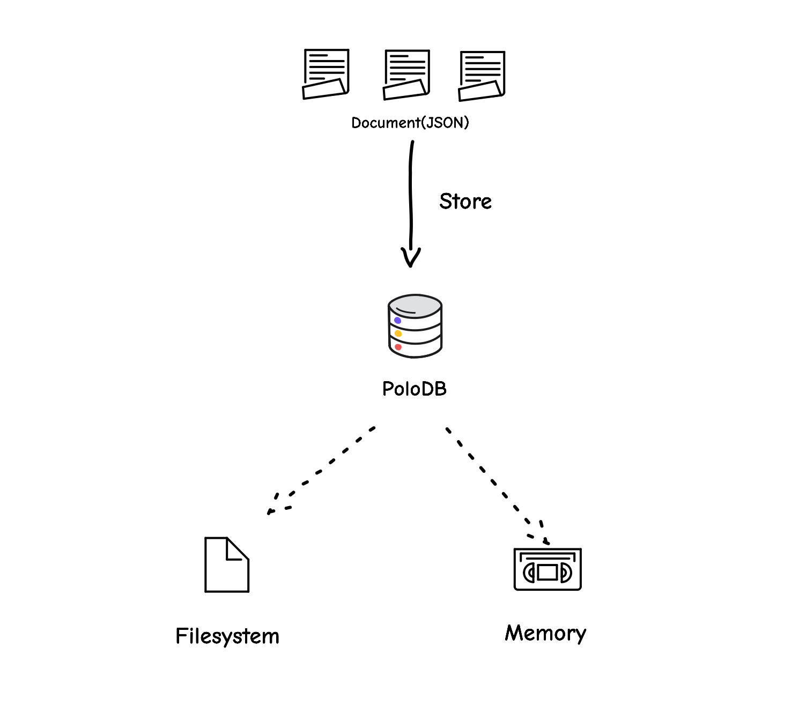

[](https://crates.io/crates/polodb_core)
[](https://discord.gg/NmGQyVx6hH)
[](https://docs.rs/polodb_core)
[](LICENSE)

PoloDB is an embedded document database.

| [Documentations](https://www.polodb.org/docs) |

# Introduction

PoloDB is a library written in Rust
that implements a lightweight [MongoDB](https://www.mongodb.com/).

# Why

PoloDB aims to offer a modern alternative to SQLite, which is currently the almost exclusive option for client-side data storage.
Although SQLite is an old and stable software, it lacks some modern features.
That's why we developed PoloDB, which is NoSQL, supports multi-threading and multi-sessions,
and retains the embedded and lightweight features of SQLite.

# Features

- Simple and Lightweight
- Easy to learn and use
  - NoSQL
  - MongoDB-like API
- Cross-Platform
- Multiple backends
  - Filesystem(WAL)
  - Memory
  - IndexedDB(WIP)

# Quick start

PoloDB is easy to learn and use:

```rust
use polodb_core::Database;
use serde::{Serialize, Deserialize};

#[derive(Debug, Serialize, Deserialize)]
struct Book {
    title: String,
    author: String,
}

let db = Database::open_file(db_path)?;
let collection = db.collection::<Book>("books");
collection.insert_one(Book {
    title: "The Three-Body Problem".to_string(),
    author: "Liu Cixin".to_string(),
})?;
```

# Backends



## Filesystem Backend

With the filesystem backend, PoloDB stores data in a single file.
All the data are saved persistently on the disk.

It's designed to be flexible, universal, and easy to be searched.
All the data are encoded in [bson](http://bsonspec.org/) format and stored in the PoloDB's lsm-tree format.

PoloDB uses WAL(write-ahead logging) to implement transactional writing and protect your data from program crashes.

## Memory Backend

With the memory backend, all the data all stored in memory, making PoloDB a pure memory database.

# Platform

Theoretically, PoloDB supports all platforms that the Rust compiler
supports.
But PoloDB is a personal project currently.
Limited by my time, I have only compiled and tested on the following platforms:

- macOS Big Sur x64
- Linux x64 (Tested on Fedora 32)
- Windows 10 x64

# Manual

- [Documentations](https://www.polodb.org/docs)
- [Rust](https://docs.rs/polodb_core)

# Roadmap

The features will be implemented one by one in order.

- [ ] Backend
  - [x] Memory
  - [x] File
  - [ ] IndexedDB(WIP)
- [x] Basic database API
  - [x] CRUD
  - [x] Transactions
  - [x] Serde
  - [x] Indexes(Alpha)
  - [ ] Aggregation
- [x] Command line Tools
- [ ] Platforms
  - [x] MacOS
  - [x] Linux
  - [x] Windows
  - [ ] Web Browser(WIP)
  - [ ] iOS
  - [ ] Android
- [ ] Visualization Tools
